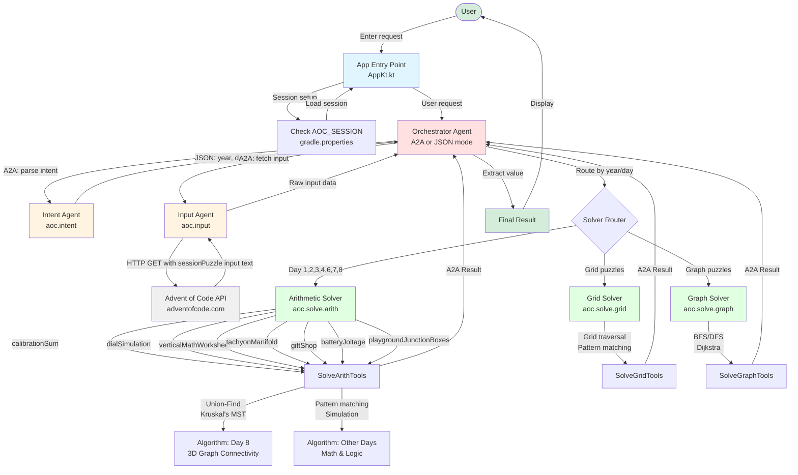
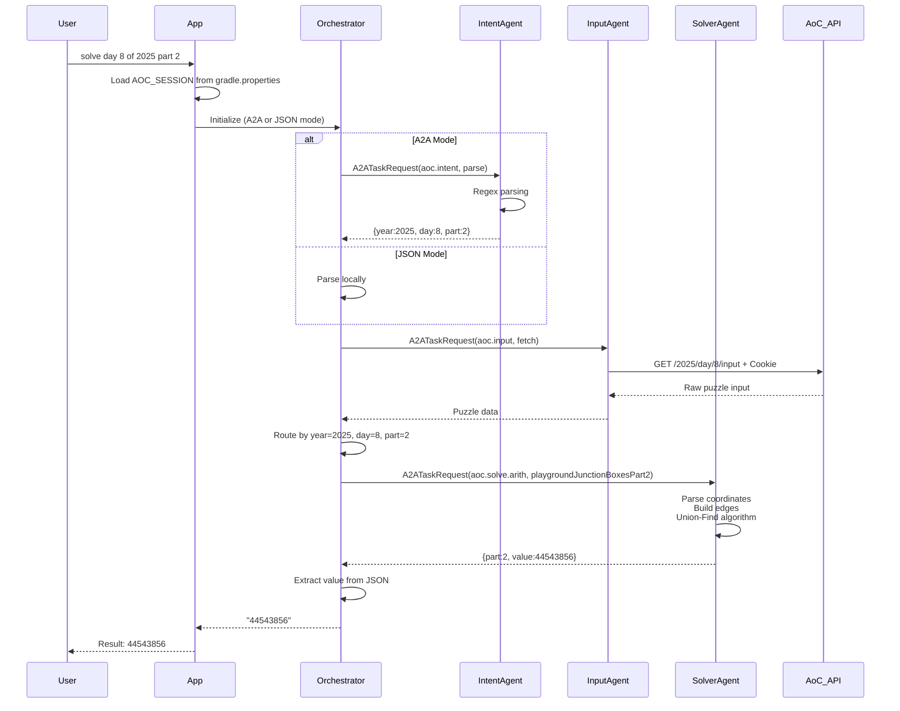

# Koog Multi-Agent Advent of Code Solver

A multi-agent system built with [Koog](https://koog.ai/) and Kotlin that automatically solves Advent of Code puzzles using AI-powered agents and Agent-to-Agent (A2A) communication.

## Overview

This project implements a collaborative multi-agent architecture where specialized solver agents communicate via an A2A protocol to solve Advent of Code challenges. The orchestrator agent coordinates the workflow: parsing user intent, fetching puzzle inputs, routing to the appropriate solver, and returning results.

## Features

- **Multi-Agent Architecture**: Specialized agents for different puzzle types (arithmetic, grid, graph)
- **A2A Protocol**: Agent-to-Agent communication for distributed problem solving
- **Automatic Puzzle Fetching**: Downloads puzzle inputs directly from Advent of Code
- **Intent Parsing**: Natural language request understanding (e.g., "solve day 8 of 2025 part 2")
- **Multiple Solver Types**: Arithmetic, grid-based, and graph-based puzzle solvers
- **LLM Integration**: Powered by Ollama for AI-driven orchestration

## Architecture

### System Flow Diagram



### Component Interaction Details



### Agent Modules

- **Orchestrator** (`agents/orchestrator`): Coordinates workflow and agent communication
- **Intent** (`agents/intent`): Parses user requests to extract year, day, and part
- **Input** (`agents/io`): Fetches puzzle inputs from Advent of Code API
- **Solve-Arith** (`agents/solve-arith`): Solves arithmetic/mathematical puzzles
- **Solve-Grid** (`agents/solve-grid`): Solves 2D grid-based puzzles
- **Solve-Graph** (`agents/solve-graph`): Solves graph/pathfinding puzzles
- **Verify** (`agents/verify`): Validates solutions
- **Parsing** (`agents/parsing`): Common parsing utilities

## Prerequisites

### 1. Java Development Kit (JDK)
- **Required**: JDK 21 or higher
- Check your version: `java -version`

### 2. Ollama
1. Install Ollama: https://ollama.com/
2. Start the Ollama service (listens on `http://localhost:11434`)
3. Pull a compatible model:
   ```bash
   ollama pull llama3.2
   ```

### 3. Advent of Code Session Cookie
To fetch puzzle inputs, you need your AoC session cookie:

1. Log in to [Advent of Code](https://adventofcode.com/)
2. Open browser DevTools (F12) → Application/Storage → Cookies
3. Copy the value of the `session` cookie
4. Add it to `gradle.properties` at the root of the project:
   ```properties
   systemProp.AOC_SESSION=<your_session_cookie_here>
   ```

**Note**: The session cookie is already configured in this project's `gradle.properties:11`. Update it with your own cookie if needed.

## Quick Start

### 1. Clone and Build

```bash
# Build the project
./gradlew build

# Or on Windows
gradlew.bat build
```

### 2. Run the Application

```bash
./gradlew run
```

### 3. Enter Your Request

When prompted, type a request like:
```
solve day 8 of 2025 part 2
```

The system will:
1. Parse your intent
2. Fetch the puzzle input from Advent of Code
3. Route to the appropriate solver
4. Return the solution

## Usage Examples

```bash
./gradlew run
```

Then enter any of these requests:
- `solve day 1 of 2023` - Solves 2023 Day 1
- `solve day 8 of 2025 part 1` - Solves 2025 Day 8 Part 1
- `solve day 8 of 2025 part 2` - Solves 2025 Day 8 Part 2
- `solve day 9 of 2025 part 2` - Solves 2025 Day 9 Part 2
- `solve day 7 of 2025` - Solves 2025 Day 7 (defaults to part 1)

## Supported Puzzles

### 2023
- **Day 1**: Calibration Sum

### 2024
- **Day 4**: (Grid-based puzzle)

### 2025
- **Day 1**: Calibration Sum
- **Day 2**: Dial Simulation
- **Day 3**: Vertical Math Worksheet
- **Day 4**: Tachyon Manifold
- **Day 6**: Gift Shop
- **Day 7**: Battery Joltage
- **Day 8**: Playground Junction Boxes (3D graph connectivity with Union-Find)
- **Day 9**: Movie Theater (Rectangle optimization with coordinate compression)

Each puzzle supports both Part 1 and Part 2 where applicable.

## Project Structure

```
KoogMultiagentProject/
├── app/                          # Main application entry point
│   ├── src/main/kotlin/AppKt.kt  # Main function, session setup
│   └── build.gradle.kts          # App configuration, stdin setup
├── agents/
│   ├── orchestrator/             # Orchestrator agent (A2A & JSON modes)
│   ├── intent/                   # Intent parsing agent
│   ├── io/                       # Input fetching agent
│   ├── solve-arith/              # Arithmetic solver agent
│   │   ├── SolveArithTools.kt    # Solver implementations
│   │   └── SolveArithA2A.kt      # A2A handlers
│   ├── solve-grid/               # Grid solver agent
│   ├── solve-graph/              # Graph solver agent
│   ├── verify/                   # Verification agent
│   └── parsing/                  # Parsing utilities
├── utils/                        # Shared utilities
├── buildSrc/                     # Gradle convention plugins
├── gradle.properties             # Gradle config + AOC_SESSION
└── README.md                     # This file
```

## How It Works

### 1. Intent Parsing
The Intent agent uses regex patterns to extract:
- Year (e.g., 2025)
- Day (e.g., 8)
- Part (1 or 2, defaults to 1)
- Scope (day, year, or unknown)

### 2. Input Fetching
The Input agent downloads puzzle input from:
```
https://adventofcode.com/{year}/day/{day}/input
```
Using your session cookie for authentication.

### 3. Solver Routing
The Orchestrator routes requests to specialized solvers based on year/day mappings:

**Arithmetic Solver** (`solve-arith`):
- Uses mathematical algorithms, pattern matching, simulation, geometric optimization
- Examples: calibration sums, dial simulations, manifold calculations
- Day 8 uses Union-Find algorithm (Kruskal's MST variant) for 3D graph connectivity
- Day 9 uses coordinate compression and scanline algorithms for efficient rectangle optimization

**Grid Solver** (`solve-grid`):
- Handles 2D grid traversal, pattern matching, cellular automata

**Graph Solver** (`solve-graph`):
- Pathfinding (Dijkstra, BFS/DFS), tree algorithms, network flow

### 4. A2A Communication
Agents communicate via A2A protocol:
```kotlin
A2ATaskRequest(
    capability = "aoc.solve.arith",
    action = "playgroundJunctionBoxes",
    payload = inputData
)
→
A2ATaskResult(
    status = OK,
    payload = "{\"part\":1,\"value\":68112,\"method\":\"playgroundJunctionBoxes\"}"
)
```

### 5. Protocols
- **A2A Mode** (default): Full multi-agent A2A communication
- **JSON Mode**: Direct solver invocation with JSON serialization

Specify protocol via:
```bash
./gradlew run --args='--protocol JSON'
```

## Performance Optimizations

### Day 9 Part 2: Coordinate Compression
The Day 9 Part 2 puzzle required finding the largest valid rectangle in a coordinate space with potentially millions of points. The naive approach of checking every coordinate was too slow.

**Problem**:
- Coordinate space could be 1,000,000 × 1,000,000
- Need to check if points are inside a polygon
- Need to validate rectangles contain only valid tiles

**Solution - Coordinate Compression**:
```
Original coordinates: [2, 7, 9, 11, 431, 825, 2000000]
Compressed indices:   [0, 1, 2,  3,   4,   5,       6]
```

**Key Optimizations**:
1. **Map coordinates to indices**: Reduce coordinate space from millions to ~hundreds
2. **Scanline algorithm**: Process each Y-coordinate once to find polygon interior
3. **Work in compressed space**: All rectangle checks use small indices
4. **Convert back only for area**: Final calculation uses original coordinates

**Result**: Reduced time complexity from O(W×H×n) to O(n²×compressed²), solving in seconds instead of hours.

Implementation: `SolveArithTools.kt:876-1000`

## Development

### Adding a New Solver

1. **Implement the solver function** in the appropriate tools file (e.g., `SolveArithTools.kt`):
   ```kotlin
   @Tool
   @LLMDescription("Solves puzzle X: description")
   fun solvePuzzleX(input: String): Long {
       // Your solution logic
       return result
   }
   ```

2. **Register the A2A handler** in the corresponding A2A file (e.g., `SolveArithA2A.kt`):
   ```kotlin
   A2ARouter.register(cap, "puzzleX", puzzleXHandler())

   private fun puzzleXHandler(): A2AHandler = { req: A2ATaskRequest ->
       val tools = SolveArithTools()
       val value = tools.solvePuzzleX(req.payload ?: "")
       A2ATaskResult(req.correlationId, A2AStatus.OK,
           payload = "{\"part\":1,\"value\":$value,\"method\":\"puzzleX\"}")
   }
   ```

3. **Add orchestrator routing** in `Orchestrator.kt`:
   ```kotlin
   year == 2025 && day == X -> {
       val action = if (part == 2) "puzzleXPart2" else "puzzleX"
       val solve = A2ARouter.send(
           A2ATaskRequest(capability = "aoc.solve.arith", action = action, payload = raw)
       )
       // Extract and return value
   }
   ```

4. **Build and test**:
   ```bash
   ./gradlew build
   ./gradlew run
   # Then enter: solve day X of 2025
   ```

### Useful Gradle Commands

```bash
./gradlew build          # Build the project
./gradlew run            # Run the application
./gradlew check          # Run tests and checks
./gradlew clean          # Clean build artifacts
./gradlew --stop         # Stop Gradle daemon (useful after config changes)
```

### Benchmarking

Enable benchmarks to measure agent performance:
```bash
./gradlew run --args='--bench'
```

Or set environment variable:
```bash
export AOC_BENCH=1
./gradlew run
```

## Configuration

### gradle.properties
```properties
# Build cache and configuration cache for faster builds
org.gradle.caching=true
org.gradle.configuration-cache=true

# File encoding
org.gradle.jvmargs=-Dfile.encoding=UTF-8

# Advent of Code session cookie
systemProp.AOC_SESSION=<your_session_cookie>
```

### app/build.gradle.kts
The stdin configuration ensures user input works correctly:
```kotlin
tasks.named<JavaExec>("run") {
    standardInput = System.`in`
}
```

## Troubleshooting

### "AOC_SESSION not defined"
- Ensure your session cookie is set in `gradle.properties`
- Check the value starts with `systemProp.AOC_SESSION=`
- Restart the Gradle daemon: `./gradlew --stop`

### Input not being read
- The stdin configuration is set in `app/build.gradle.kts:35-37`
- If it still doesn't work, use `--args` to pass requests:
  ```bash
  ./gradlew run --args='--request "solve day 8 of 2025"'
  ```

### Gradle cache issues
```bash
./gradlew clean
./gradlew --stop
./gradlew build
```

### Wrong result returned
- Verify the correct day/year is being parsed
- Check orchestrator routing for the specific day
- Enable benchmarks to see which solver is called

## Technologies

- **Kotlin**: JVM language for agent implementation
- **Gradle**: Build system and dependency management
- **Koog Framework**: AI agent orchestration
- **Ollama**: Local LLM inference (llama3.2)
- **Ktor**: HTTP client for AoC API
- **Coroutines**: Async/concurrent operations

## Algorithm Highlights

- **Union-Find (Disjoint Set Union)**: Day 8 junction boxes connectivity
- **Kruskal's Algorithm**: MST variant for graph construction
- **Path Compression**: Optimized Union-Find operations
- **Coordinate Compression**: Day 9 Part 2 - reduces large coordinate space to unique values
- **Scanline Algorithm**: Day 9 Part 2 - efficient polygon interior detection
- **Ray Casting**: Point-in-polygon testing
- **Greedy Algorithms**: Closest-pair connection strategies, rectangle optimization
- **Dynamic Programming**: Various puzzle optimization problems
- **BFS/DFS**: Grid and graph traversal
- **Regex Parsing**: Intent and input parsing

## License

This project is for educational purposes as part of Advent of Code challenge participation.

## References

- [Advent of Code](https://adventofcode.com/)
- [Koog AI Framework](https://koog.ai/)
- [Ollama](https://ollama.com/)
- [Gradle](https://gradle.org/)
